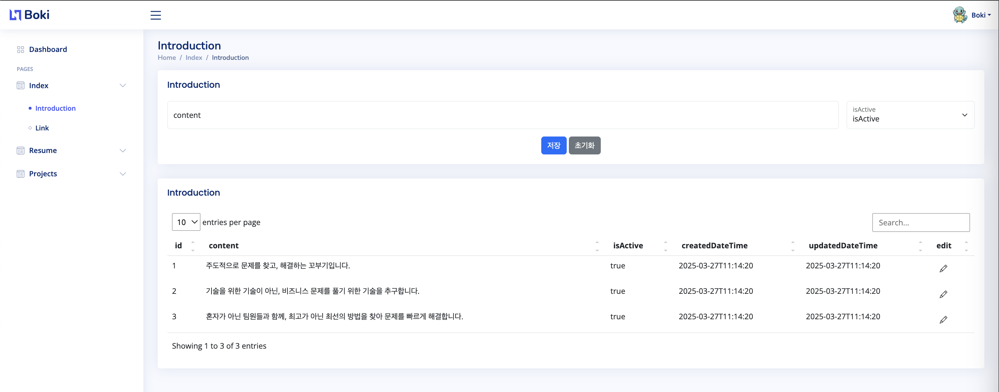
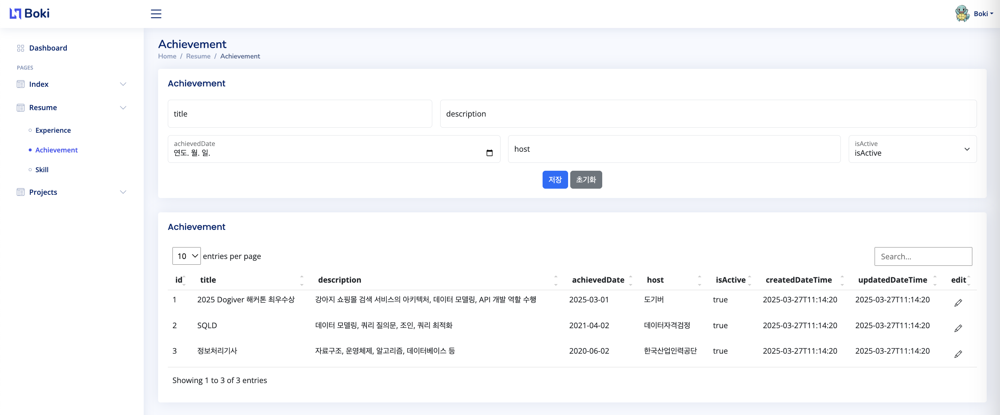

# Boki's Simple Portfolio

$\textcolor{#808080}{웹사이트에서\ 꼬부기\ 이미지를\ 누르면\ 좋은\ 걸\ 발견할지도\ ...}$

개발자 꼬부기 이승복의 포트폴리오 사이트입니다.

간단한 소개와 SNS 링크, 경력과 학력, 수상과 자격증, 기술스택, 진행한 프로젝트 경험 등을 기술할 수 있습니다.

이 프로젝트는 Kotlin, Spring Boot, MySQL, JPA, Git, Docker, Google Cloud Platform, Bootstrap 등의 기술을 사용했습니다.

[boki-dev.com](https://boki-dev.com/)에 방문해서 자세히 살펴보세요 :)

유저의 접속 정보를 확인하고, 관련 데이터를 쉽게 관리할 수 있도록  
Back Office Page 및 Admin API도 구현되어 있습니다.

